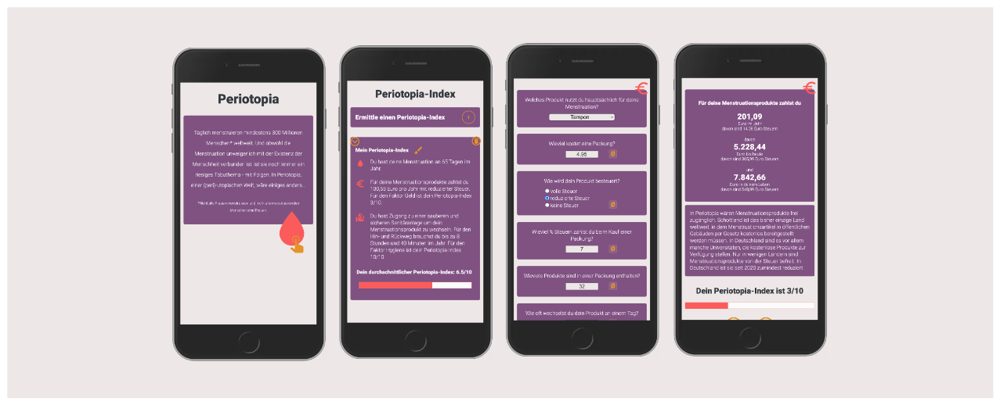

# Periotopia

Periotopia is a micro-learning app focussing on menstrual health. Explore diverse aspects and gain insights into its impact on individuals and society through various questionnaires. The Periotopia-Index acts as your compass, indicating your proximity to a utopian, period-positive world.

> This is the final project for neuefische web dev bootcamp.

Note: The App is optimized for mobile screen.

## Demo

You can find the [hosted version](https://periotopia.vercel.app) on Vercel:

## Tech Stack

- React
- React Hooks
- Next.js
- styled-components
- useLocalStorage
- uid
- mdi Pictogrammers
- react-confirm-alert
- npm
- vercel

## Project Setup

- Clone this repository
- Install all dependencies using `npm install`
- Run app in development mode using `npm run dev`, and open [http://localhost:3000/](http://localhost:3000/)
- To build the project run `npm run build`
- To run a production server use `npm run start`
