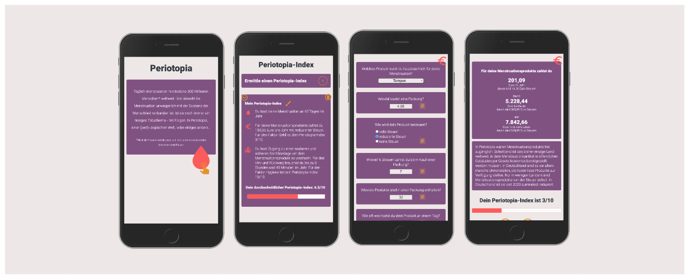

# Periotopia

Periotopia is a micro-learning app focussing on menstrual health. Explore diverse aspects and gain insights into its impact on individuals and society through various questionnaires. The Periotopia-Index serves as your compass, indicating your proximity to a utopian, period-positive world.

This app is my final project for neuefische Web Development Bootcamp, summer 2023.

## Demo

You can find a [hosted version](https://periotopia.vercel.app) on Vercel

Note: The App is optimized for mobile screen.

## Tech Stack

- React
- React Hooks
- Next.js
- styled-components
- uid
- mdi Pictogrammers
- react-confirm-alert

## Project Setup

- Clone this repository
- Install all dependencies using `npm install`
- Run the app in development mode using `npm run dev`, and open [http://localhost:3000/](http://localhost:3000/)
